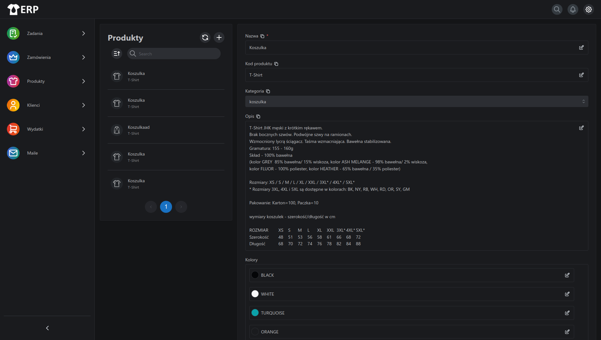
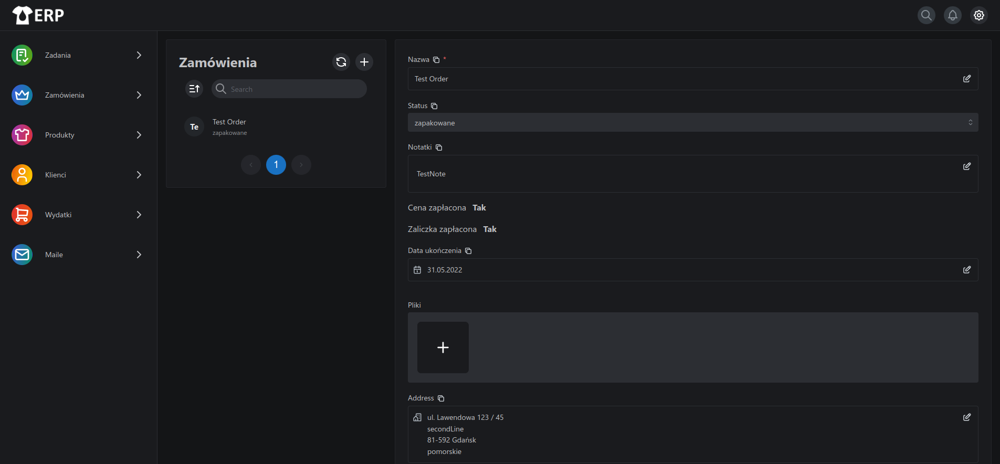

# ShirtERP

System do zarządzania zamówieniami i produktami dostosowany do potrzeb drukarni odzieży. Został  on zaprojektowany tak, aby umożliwić zarządzanie procesami związanymi z zamówieniami, obsługą klientów oraz kontrolą wydatków, dodatkowo pozwala on na:
- Edycję arkuszy kalkulacyjnych związanych z zamówieniami oraz oznaczanie zapakowanych towarów na podstawie tych tabel
- Dodawanie emaili oraz załączonych w nich plików do zamówień
  
System został zakupiony przez firmie Wentaprint.  

**Tech:**  Next.js, tRPC, Tailwindcss, Radix-ui(shadcn), DrizzleORM, imapflow, mailparser  

**DEMO:** [shirterp.eu](https://shirterp.eu/)  

   

## Installation instructions

1. Install and configure postgresql.
2. Install node 18, yarn, git
3. Git clone this repository and select tag of version you want to use.
4. Run `yarn` in cloned folder to install dependencies, then run `yarn build` to build application UI.
5. Set env variables in .env file
6. Server is now ready and can be started with `yarn prod` command

#### Licencja komercyjna
W przypadku chęci kupna systemu proszę o kontakt przez mail: kifner.mateusz(αt)gmail.com

#### License Proprietary
For business deals please contact me via mail: kifner.mateusz(αt)gmail.com

ShirtERP is Copyright (c) Mateusz Kifner kifner.mateusz(αt)gmail.com
